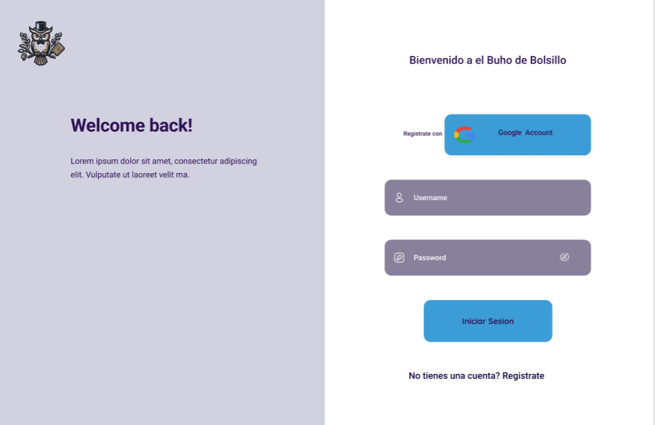

# Buho de Bolsillo

## Sec 01 - Grupo N° 22

### Integrantes

| Nombre                                 | Carnet                |
| ---------------------------------------|-----------------------|
|Josué Daniel Pérez Nájera               |      00027822         |
|Franklin Enmanuel Barton Pleitez        |      00134721         |
|Jonathan Eduardo Cornejo Galicia        |      00209821         |

---

# Manual de usuario para el Buho de Bolsillo (BDB)
# Usuario a utilizar para test:

- buhoadmin
- contrasenia: adminpro69

## Introducción a las funciones y descripcion sobre el BDB :

El BDB es una web app diseñada y creada por alumnos de la UCA para alumnos y catedraticos de la UCA, el motivo por el cual esta fue creada es simple, para que los usuarios puedan tener un mejor control de sus finanzas y dejen de tener gastos hormiga. Este manual fue creado con al intención de ayudar a los usuarios a que tengan la mejor experiencia posible utilizando el BDB. Asi como que el usuario conozca todas las funciones que tenemos para ofrecer las cuales son:

- ### Creacion de cuenta
  
Para poder utilizar las funciones que te ofrecemos es tan simple como crear una cuenta con tu correo (Gmail). Dando click en el boton con la leyenda "Comienza ahora o Registrate"

Luego deberas de llenar los campos respectivos y darle click al boton registrarse y listo ya podras tener tu cuenta.

- ### Inicio de sesion

Luego de haber creado tu cuenta deberas de iniciar sesion para acceder a todas las funciones que te ofreceremos y seran mencionadas mas adelante.

Para iniciar sesion solo deberas de escribir tu correo y tu contraseña en los campos respectivos

- ### Ver tu balance

La primera de las funciones que estaran a simple vista seran la de ver tu balance, para hacer esto solo deberas de dar click al cuadro morado.

En este menu podras ver tu balance y el historial de gastos que haz agregado.

- ### Añadir gasto o ingreso

La segunda funcion que ofrecemos es la de ingresar un gasto o ingreso esta funcion es una de las principales de nuestra web app. En este apartado podras escribir la cantidad y una descripcion del gasto realizado ademas de agregar una fecha y darle click a confirmas gasto o ingreso dependiendo de lo selecciones.

Luego te aparecera la siguiente pantalla de confirmacion sobre la accion que realizaras.

- ### Añadir meta de ahorro

La siguiente funcion es la de añadir un recordatorio de meta de ahorro en esta podras ecribir el monto que deseas ahorrar y un nombre que quieras agregar a la meta y una breve descripcion. Para ingresar a esta solo deberas darle click a la opcion en la seccion home de el BDB

Luego de haber llenado los campos solo deberas de darle al boton que tiene la leyenda "Confirmar", luego te aparacera la pantalla de confirmacion.

- ### Agregar un evento 

La tercera funcion es la de crear un evento en esta funcion podras crear un recordatorio para algun pago que debas hacer en el futuro, podras hacer eventos especificando la fecha que tu desees. Para entrar en esta apartado deberas de seleccionarlo en la seccion Home de el BDB.

Luego de haber llenado los campos con la informacion que se te solicita deberas de confirmarlo y aparecera la respectiva pantalla de confirmacion

- ### Notificaciones

El apartado de notificaciones es donde podras mantenerte informado sobre las metas que creaste o recordatorios, para ir a este apartado podras ir dando le click al texto que dice notificaciones en el encabezado de la pagina.

- ### Informacion del usuario

Para poder ver tu informacion como tu correo, nombre completo o tu usuario todo esto esta en el apartado de perfil.

